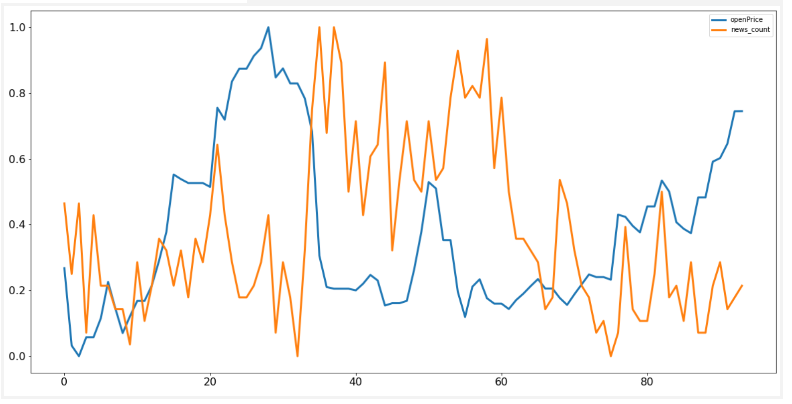

## Correlation between stock variables

Obviously, High correlation between `Last Price Vs. 50D SMA` and `1M Perf`

Also, `1M Perf` seems to be slightly correlated to `P/E FWD`, `Price / Sales`, `Revenue FWD`, `Insider %`, `Debt to Equity`
And less correlated to last years revenue `Revenue YoY`

No correlation between `News Count` and `stock price` for Neflix

